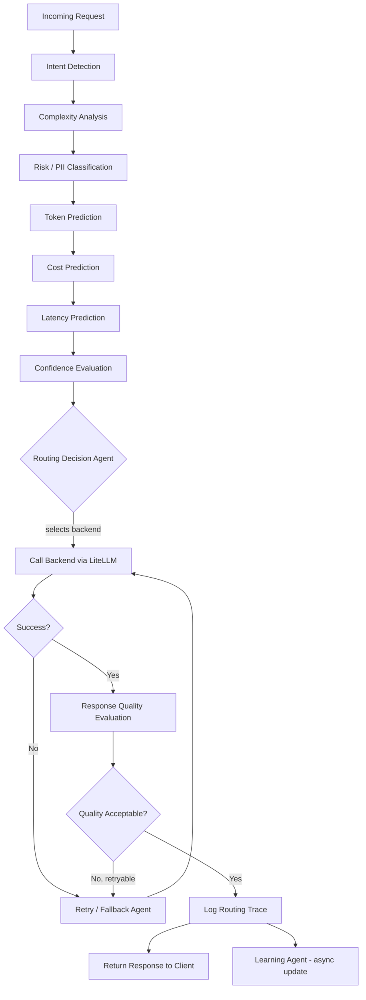

# Phase 3 — AI System Design
## Enterprise AI Gateway: Hybrid Token-Efficient Routing Agent

---

## 1. AI Architecture Overview

The routing brain is a **LangGraph state machine**, not a single monolithic LLM call — most nodes are cheap heuristics/small classifiers, with an optional LLM-based "judge" node reserved for ambiguous cases only, to avoid the router itself becoming the token-cost problem it's solving.

## 2. Agent Architecture

| Agent | Responsibility | Implementation |
|---|---|---|
| Intent Detection Agent | Classify request into {code, summarization, extraction, creative, QA, reasoning, chat} | Lightweight local classifier (embedding + logistic regression) or Gemma few-shot |
| Complexity Analysis Agent | Score 0–1 for reasoning depth required | Heuristics (prompt length, code presence, multi-step markers) + Gemma fallback |
| Risk/PII Classification Agent | Detect PII/sensitive content | Regex + NER model (e.g., presidio-style) run locally, never sent to cloud |
| Token Prediction Agent | Estimate input/output token count | tokenizer-based input count + regression model for output length by intent class |
| Cost Prediction Agent | Estimate $ cost per candidate backend | token estimate × provider pricing table |
| Latency Prediction Agent | Estimate response time per candidate backend | rolling average of recent observed latencies per backend (stored in Redis) |
| Confidence Evaluation Agent | Estimate likelihood chosen backend will produce acceptable quality | historical success rate per (intent, complexity bucket, backend) |
| Routing Decision Agent | Combine all signals into final backend choice | weighted policy function (see §4) |
| Response Quality Evaluation Agent | Post-hoc score of response (heuristic + optional judge call) | used for retry trigger + learning signal |
| Retry/Fallback Agent | Handle backend failure or low-quality response | policy-driven backend substitution |
| Learning Agent | Update historical success-rate table from feedback/quality signals | async job updating Redis/Postgres stats |

## 3. LangGraph Flow



## 4. Routing Logic

Routing decision is a weighted scoring function over eligible backends, evaluated after ineligible ones are filtered out:

**Step 1 — Eligibility filter**
- If risk = high and org privacy policy = strict → only local backend(s) eligible.
- If token estimate > backend context window → backend ineligible.
- If backend health check failed in last N seconds → ineligible.

**Step 2 — Score each eligible backend**
```
score(backend) = w1*(1 - normalized_cost)
               + w2*(1 - normalized_latency)
               + w3*(predicted_quality_confidence)
               + w4*(budget_pressure_bonus if backend is cheap)
```
Default weights: quality 0.4, cost 0.3, latency 0.2, budget pressure 0.1 — configurable per org.

**Step 3 — Select** highest-scoring backend; log all scores in the routing trace for explainability.

## 5. Token Prediction
Input tokens: exact via provider tokenizer (tiktoken-equivalent per provider, or a unified approximation for the demo). Output tokens: predicted via regression on (intent class, input length, historical average output length for that intent) — refined over time by the Learning Agent.

## 6. Confidence Evaluation
Maintains a rolling table: `(intent, complexity_bucket, backend) -> success_rate` from historical quality evaluations and explicit user feedback. Cold-start default confidence uses a reasonable prior per backend tier (e.g., frontier cloud models start higher for "reasoning"/"code", local model starts higher for "extraction"/"chat").

## 7. Risk Analysis
Risk categories: none, low (generic business info), high (PII: names+contact, financial identifiers, health info, credentials/secrets). High-risk detection uses local-only NER + regex, never a cloud call, to avoid leaking the very data being protected.

## 8. Complexity Analysis
Signals: prompt length, presence of code blocks, multi-step/"first...then...finally" language, requested output length, domain-specific vocabulary density. Combined into 0–1 score via a small trained/hand-tuned function; documented and testable in isolation.

## 9. Intent Detection
Categories mapped to typical backend affinities (e.g., "code" → Claude/GPT strong, "chat/extraction" → Gemma often sufficient). Classifier trained on lightweight labeled examples or done via embedding-similarity to category exemplars for MVP speed.

## 10. Model Selection Strategy
Default affinity priors (tunable, shown in dashboard for transparency):

| Intent | Preferred order (quality-first) | Preferred order (cost-first) |
|---|---|---|
| Simple QA / chat | Gemma → Gemini → Claude → GPT | Gemma → Gemini |
| Code generation | Claude → GPT → Gemini → Gemma | Gemini → Claude |
| Summarization/extraction | Gemma → Gemini → Claude | Gemma |
| Creative writing | Claude → GPT → Gemini | Gemini → Gemma |
| Deep reasoning | GPT → Claude → Gemini | Claude → Gemini |

## 11. Fallback Strategy
Ordered fallback chain per intent (above), skipping ineligible/unhealthy backends; max 2 retries before returning a clear error with trace ID.

## 12. Cost Optimization Strategy
Budget-pressure bonus increases as org's monthly spend approaches its threshold, progressively biasing routing toward Gemma/cheaper backends; hard cap option to force-local once budget is exhausted.

## 13. Caching Strategy
Two tiers:
1. **Exact-match cache** (Redis, hash of normalized prompt+params) — instant, zero cost.
2. **Semantic cache** (FAISS embedding similarity, threshold ~0.92 cosine) — catches near-duplicate prompts; disabled by default for anything risk≠none to avoid leaking risk-sensitive content across cache boundaries.

## 14. Memory Strategy
Session-scoped conversation memory stored in Redis (TTL-bound) keyed by session ID; summarized/truncated when approaching context limits before being re-sent to the chosen backend.

## 15. Learning Strategy
Feedback (explicit thumbs up/down + implicit signals like immediate retry-with-different-model) feeds the Learning Agent, which updates the confidence table asynchronously — no online fine-tuning of any model in MVP, purely statistics-table learning to keep it explainable and fast.

## 16. Explainability Strategy
Every response includes a routing trace ID; `GET /v1/traces/{id}` returns the full breakdown: intent, complexity, risk, token estimate, per-backend scores, chosen backend, and reason string (e.g., `"routed to gemma-local: risk=high, privacy policy=strict"`). Surfaced in the dashboard as a human-readable explanation panel.

---

**Next:** Phase 4 — System Architecture (services, data stores, diagrams).
