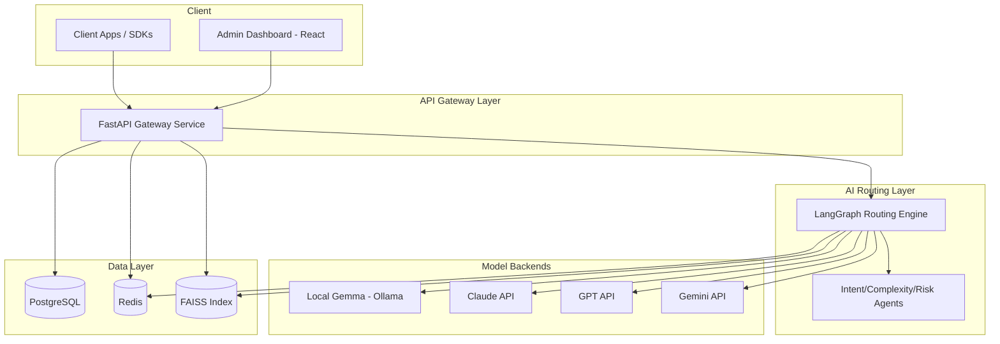
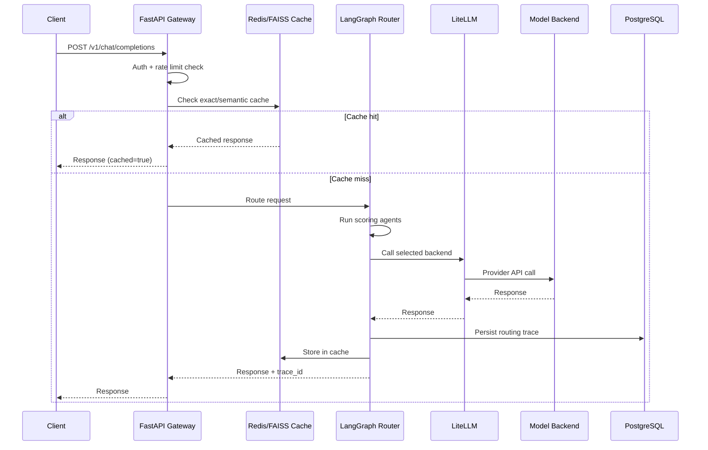

# Phase 4 — System Architecture
## Enterprise AI Gateway: Hybrid Token-Efficient Routing Agent

---

## 1. High-Level Architecture

## 2. Low-Level Architecture (Request Path)

## 3. Microservices Breakdown

For hackathon scope, deployed as a **modular monolith** (single FastAPI app, cleanly separated modules) rather than true microservices — faster to build/demo, same clean boundaries so it could be split later.

| Module | Responsibility |
|---|---|
| `gateway/` | HTTP API, auth, rate limiting |
| `routing/` | LangGraph engine + scoring agents |
| `providers/` | LiteLLM wrappers per backend |
| `cache/` | Redis exact-match + FAISS semantic cache |
| `analytics/` | Cost/token/usage aggregation queries |
| `admin/` | Org/user/API-key management |

## 4. Backend Services
FastAPI (async), Uvicorn/Gunicorn workers, stateless — all shared state in Redis/Postgres so it scales horizontally behind a load balancer.

## 5. Frontend Architecture
React + TypeScript + Vite + Tailwind SPA calling the gateway's REST/analytics endpoints; see Phase 7 for detail.

## 6. AI Services
LangGraph orchestrates the agent graph from Phase 3; LiteLLM abstracts provider-specific SDK differences behind one call signature; LangChain used for prompt templating/output parsing where an LLM-based agent (e.g., ambiguous-case judge) is used.

## 7. Database
PostgreSQL — orgs, users, API keys, routing traces, feedback, budgets. See Phase 5.

## 8. Redis
Roles: exact-match response cache, rate-limit token buckets, session/conversation memory, rolling latency/success-rate stats, budget-pressure counters.

## 9. FAISS
In-process vector index (or FAISS server) storing prompt embeddings for semantic cache lookups; rebuilt/persisted periodically; excluded from any risk≠none content by policy.

## 10. Docker
Each service (gateway, Postgres, Redis, optional FAISS sidecar, Ollama for Gemma, frontend) runs as a container defined in `docker-compose.yml` (Phase 12).

## 11. API Gateway
The FastAPI app itself is the gateway (auth, rate limiting, routing dispatch) — no separate Kong/Envoy layer needed for MVP; documented as a clean seam to add one in production hardening.

## 12. Monitoring
Structured JSON logs; `/metrics` Prometheus-compatible endpoint (request count, routing distribution, latency histograms, cache hit rate); optional Grafana dashboard stretch goal.

## 13. Logging
Every request gets a correlation/trace ID propagated through all agents and into the persisted routing trace; logs include this ID for cross-referencing.

## 14. Security
API-key auth (hashed at rest), per-org rate limiting, encrypted secrets via environment/Docker secrets, input validation on all endpoints, no raw prompt text in application logs (only in the dedicated, access-controlled trace table).

---

**Next:** Phase 5 — Database Design (ER diagram, schema, indexes).
