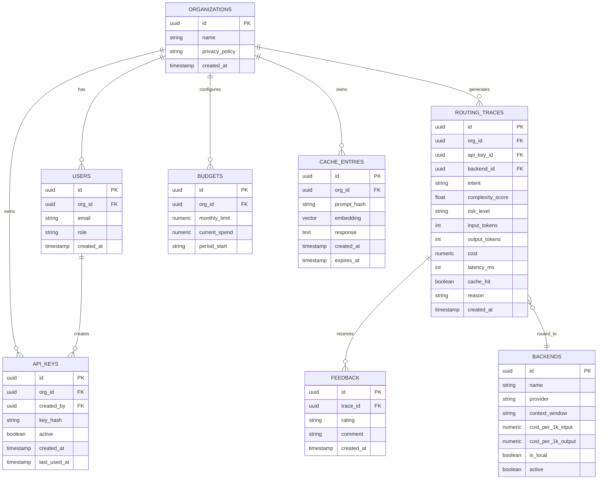

# Phase 5 — Database Design
## Enterprise AI Gateway: Hybrid Token-Efficient Routing Agent

---

## 1. ER Diagram



## 2. Database Schema (DDL summary)

```sql
CREATE TABLE organizations (
    id UUID PRIMARY KEY DEFAULT gen_random_uuid(),
    name VARCHAR(255) NOT NULL,
    privacy_policy VARCHAR(50) NOT NULL DEFAULT 'strict',
    created_at TIMESTAMPTZ NOT NULL DEFAULT now()
);

CREATE TABLE users (
    id UUID PRIMARY KEY DEFAULT gen_random_uuid(),
    org_id UUID NOT NULL REFERENCES organizations(id) ON DELETE CASCADE,
    email VARCHAR(255) UNIQUE NOT NULL,
    role VARCHAR(50) NOT NULL DEFAULT 'member',
    created_at TIMESTAMPTZ NOT NULL DEFAULT now()
);

CREATE TABLE api_keys (
    id UUID PRIMARY KEY DEFAULT gen_random_uuid(),
    org_id UUID NOT NULL REFERENCES organizations(id) ON DELETE CASCADE,
    created_by UUID REFERENCES users(id),
    key_hash VARCHAR(255) NOT NULL,
    active BOOLEAN NOT NULL DEFAULT true,
    created_at TIMESTAMPTZ NOT NULL DEFAULT now(),
    last_used_at TIMESTAMPTZ
);

CREATE TABLE backends (
    id UUID PRIMARY KEY DEFAULT gen_random_uuid(),
    name VARCHAR(100) UNIQUE NOT NULL,
    provider VARCHAR(50) NOT NULL,
    context_window INT NOT NULL,
    cost_per_1k_input NUMERIC(10,6) NOT NULL,
    cost_per_1k_output NUMERIC(10,6) NOT NULL,
    is_local BOOLEAN NOT NULL DEFAULT false,
    active BOOLEAN NOT NULL DEFAULT true
);

CREATE TABLE routing_traces (
    id UUID PRIMARY KEY DEFAULT gen_random_uuid(),
    org_id UUID NOT NULL REFERENCES organizations(id),
    api_key_id UUID REFERENCES api_keys(id),
    backend_id UUID REFERENCES backends(id),
    intent VARCHAR(50),
    complexity_score FLOAT,
    risk_level VARCHAR(20),
    input_tokens INT,
    output_tokens INT,
    cost NUMERIC(10,6),
    latency_ms INT,
    cache_hit BOOLEAN NOT NULL DEFAULT false,
    reason TEXT,
    created_at TIMESTAMPTZ NOT NULL DEFAULT now()
);

CREATE TABLE feedback (
    id UUID PRIMARY KEY DEFAULT gen_random_uuid(),
    trace_id UUID NOT NULL REFERENCES routing_traces(id) ON DELETE CASCADE,
    rating VARCHAR(10) NOT NULL,
    comment TEXT,
    created_at TIMESTAMPTZ NOT NULL DEFAULT now()
);

CREATE TABLE budgets (
    id UUID PRIMARY KEY DEFAULT gen_random_uuid(),
    org_id UUID NOT NULL REFERENCES organizations(id) ON DELETE CASCADE,
    monthly_limit NUMERIC(10,2) NOT NULL,
    current_spend NUMERIC(10,2) NOT NULL DEFAULT 0,
    period_start DATE NOT NULL
);

CREATE TABLE cache_entries (
    id UUID PRIMARY KEY DEFAULT gen_random_uuid(),
    org_id UUID NOT NULL REFERENCES organizations(id) ON DELETE CASCADE,
    prompt_hash VARCHAR(64) NOT NULL,
    response TEXT NOT NULL,
    created_at TIMESTAMPTZ NOT NULL DEFAULT now(),
    expires_at TIMESTAMPTZ
);
```
(FAISS embeddings are stored in the FAISS index itself, keyed by `cache_entries.id`, not as a Postgres column — a `vector` extension column is an optional stretch alternative.)

## 3. Relationships
One org → many users, API keys, routing traces, budgets, cache entries. One routing trace → zero-or-one feedback, one backend. One user → many API keys.

## 4. Indexes

```sql
CREATE INDEX idx_traces_org_created ON routing_traces(org_id, created_at DESC);
CREATE INDEX idx_traces_backend ON routing_traces(backend_id);
CREATE UNIQUE INDEX idx_api_keys_hash ON api_keys(key_hash);
CREATE INDEX idx_cache_org_hash ON cache_entries(org_id, prompt_hash);
CREATE INDEX idx_budgets_org_period ON budgets(org_id, period_start);
```

## 5. Constraints
- `api_keys.key_hash` unique — no duplicate keys.
- `routing_traces.risk_level` CHECK IN ('none','low','high').
- `feedback.rating` CHECK IN ('up','down').
- `budgets.current_spend >= 0` CHECK constraint.
- Cascade deletes scoped to org (deleting an org cleans up its data).

## 6. Query Optimization
Dashboard queries pre-aggregate via a materialized view refreshed every few minutes for demo-scale performance:

```sql
CREATE MATERIALIZED VIEW daily_org_cost AS
SELECT org_id, backend_id, date_trunc('day', created_at) AS day,
       SUM(cost) AS total_cost, SUM(input_tokens+output_tokens) AS total_tokens,
       COUNT(*) AS request_count
FROM routing_traces
GROUP BY org_id, backend_id, day;
```
Refreshed via a scheduled job (`REFRESH MATERIALIZED VIEW CONCURRENTLY daily_org_cost;`).

## 7. Migration Strategy
Alembic for schema migrations, versioned in `backend/migrations/`; every schema change ships as a reviewed migration file, applied automatically on container startup in dev and via CI/CD gate in production (Phase 12).

---

**Next:** Phase 6 — API Design (full endpoint catalogue).
